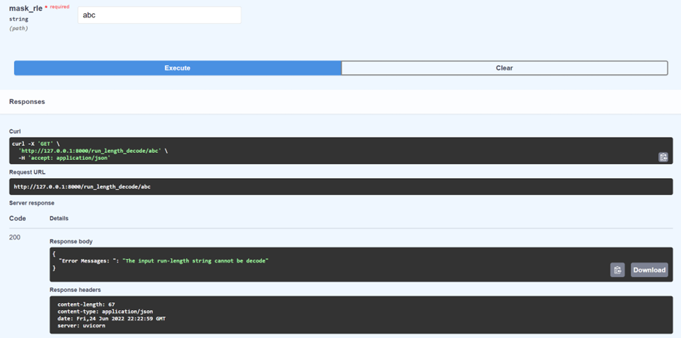

# Team1 API Doc notes

> main focus on tran_ship_segment_v2.csv and tran_v2.folder

- There are two rows: image_id, encoded pixels
- There are two results in images: with ship or without ship

## API Function 1: get image and masks

### Input

- User input required
- @param: imageid
- @type: str
- @default: imgshape (768,768)

### Output

- a original image in Numpy array format
- a mask of image in Numpy array format

### Error Handeling

- If name of image file invalid, return Team 1 custom String

## API function 2: get run length decode

### Input

- User input required
- @param mask_rle: run-length
- @type str
- @default: imgshape (768,768)

### Output

- return a Numpy array with 2 types of int value: 0,1
- 0 means no ship, 1 means in this position has ship

### Error Handeling

- return a Team 1 custom error message

## API function 3: get ship and non-ship image

### Input

- User input required
- @param "ship" or "noship"
- @type: str

### Output

- one of the images name with "ship" or "noship" condition in the image

### Error Handeling

- return Team1 custom error message

## API function 4: get the number of images that has certain number of ships

### Input

- User input required
- @param num  ->  number of ships in an image
- @type: int

### Output

- return number of images with certian input number of ships

### Error Handeling

- return Team1 custom error message

## API Function 5: get image directly from S3

### Input

- User input required
- @param: file name in the S3 storage
- @type: str

### Output

- return a Numpy array of the image pixels

### Error Handeling

- return Team 1 custom error message

## API function 6: get the number of ships in a certain image

### Input

- User input required
- @param image filename
- @type: str

### Output

- return an integer, count number of ships are in this image

### Error Handeling

- return Team1 custom error message

